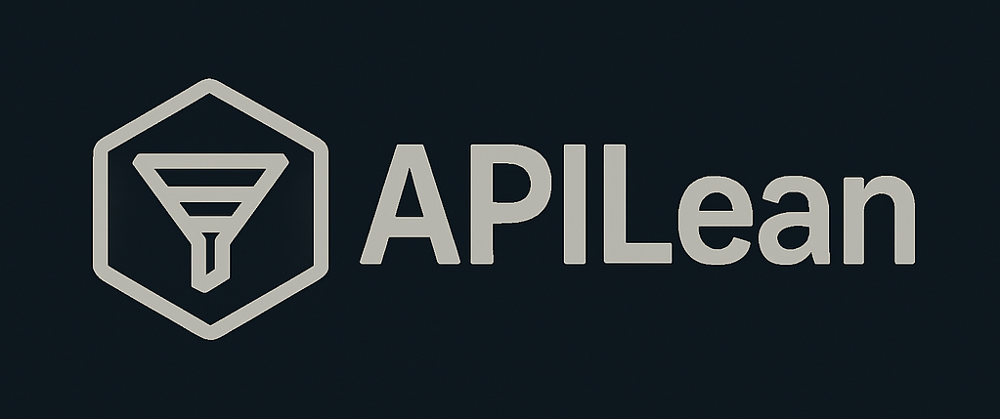

# APILean



A minimalist, no-nonsense API testing tool built to avoid the bloat of Postman, Insomnia, and similar apps. No signups, no forced cloud sync, no disk-hogging collections—just a lean, local app for sending HTTP requests and getting work done.

## Features
- **Simple UI**: URL, method, headers, and body input with a raw response view.
- **Headers Editor**: Add custom key-value pairs dynamically.
- **JSON Support**: Pretty-printed responses and JSON body input for POST/PUT.
- **Variables**: Use `{{key}}` placeholders in URL, headers, and body.
- **Request Chaining**: Store responses (e.g., `{{last_response}}`) for use in subsequent requests.
- **Export/Import**: Save and load sessions as a single JSON file, on demand.
- **Lightweight**: Runs in-memory, no persistent storage unless you choose to export.

## Installation
1. **Prerequisites**:
   - Python 3.x
   - `requests` library (`pip install requests`)
2. **Clone the Repo**:
   ```bash
   git clone https://github.com/makalin/APILean.git
   cd APILean
   ```
3. **Run It**:
   ```bash
   python apilean.py
   ```

## Usage
1. **Basic GET**:
   - URL: `https://api.github.com/users/octocat`
   - Method: GET
   - Click "Send" to see the JSON response.

2. **POST with Body**:
   - URL: `https://reqres.in/api/users`
   - Method: POST
   - Body: `{"name": "Grok", "job": "AI"}`
   - Send and check the response.

3. **Headers**:
   - Add a header: `User-Agent` = `APILeanTest`
   - Test with any request.

4. **Variables**:
   - URL: `{{baseUrl}}/users`
   - Set `variables["baseUrl"] = "https://reqres.in/api"` in code (UI coming soon).
   - Send to see it resolve.

5. **Chaining**:
   - POST to `https://reqres.in/api/login` with `{"email": "eve.holt@reqres.in", "password": "cityslicka"}`.
   - Use `{{last_response}}` in a header (e.g., `Authorization: {{last_response.token}}`) after manual parsing.

6. **Export/Import**:
   - Set up a request, click "Export" to save as `apilean_session.json`.
   - Tweak something, then "Import" to restore.

## Roadmap
- **Phase 4**: Keyboard shortcuts, better error handling, single-executable packaging.
- **Phase 5**: Scriptable requests (e.g., JS snippets), proxy support, CLI mode.
- **UI Polish**: Variables editor, finer chaining control.

## Why APILean?
Sick of bloated tools that demand accounts and shove "collections" down your throat? APILean is for developers who want control, simplicity, and no fluff. Built from scratch to solve real pain points.

## Contributing
Pull requests welcome! Keep it lean and focused. Open an issue to discuss ideas first.

## License
MIT License—do what you want with it.
